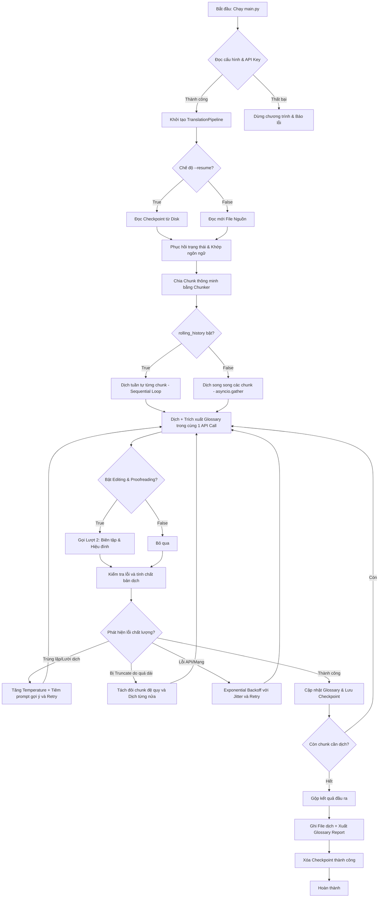

# 📚 Novel Translator Pipeline (v2) - System Documentation & Architecture

Tài liệu này mô tả chi tiết kiến trúc hệ thống, luồng xử lý (tool flow), thiết kế mã nguồn và các tính năng nâng cao đã được tích hợp trong phiên bản **v2** của hệ thống dịch truyện bằng LLM.

---

## 1. Luồng xử lý dữ liệu (Tool Flow)

Hệ thống hoạt động theo mô hình bất đồng bộ (Asynchronous Event-driven Pipeline) với luồng dữ liệu đi qua các bước được biểu diễn qua sơ đồ sau:



### Luồng chi tiết:
1.  **Khởi tạo & Phát hiện ngôn ngữ**: Nhận diện ngôn ngữ nguồn (Tiếng Trung, Anh, Nhật, Hàn) bằng thuật toán heuristic và lấy cấu hình tương ứng trong `genres.yaml`.
2.  **Chia nhỏ văn bản (Smart Chunking)**: Phân tách tệp truyện thành các đoạn nhỏ (mặc định 2500 tokens) dựa trên ranh giới đoạn văn hoặc câu để tránh làm rách mạch truyện.
3.  **Dịch + Trích xuất Thuật ngữ/Nhân vật Hợp nhất (Unified Translation + Glossary Extraction)**:
    *   Trong **cùng một API call**, mô hình thực hiện dịch thô đoạn văn bản sang tiếng Việt (được bọc trong thẻ `<translation>`) đồng thời thực hiện quét toàn bộ văn bản để bóc tách từ khóa/nhân vật mới (được bọc trong thẻ `<glossary>` chứa JSON).
    *   Hệ thống tự động phân tích cú pháp thẻ XML và nạp các thực thể phát hiện được vào `GlossaryManager` an toàn luồng.
4.  **Hiệu đính & Đánh bóng (Editing & Proofreading)**:
    *   Nếu bật `editing_and_proofreading: true` trong cấu hình, hệ thống thực hiện một lượt API call thứ hai để rà soát lỗi chính tả, câu sượng, văn phong văn học tiếng Việt và điều chỉnh cách xưng hô dựa trên ngữ cảnh và bảng glossary cập nhật.
5.  **Hậu xử lý & Lưu trữ**: Xuất văn bản dịch hoàn chỉnh ra thư mục `output/` kèm theo một báo cáo thuật ngữ định dạng Markdown (`*_glossary_report.md`).

---

## 2. Giải thích chi tiết các Module mã nguồn (Codebase)

### 2.1. `main.py` (CLI Entry Point)
*   **Chức năng**: Quản lý giao diện dòng lệnh (Command Line Interface).
*   **Nhiệm vụ chính**:
    *   Phân tích cú pháp các tham số đầu vào (`--project`, `--genre`, `--input`, `--workers`, `--resume`, `--status`...).
    *   Nạp biến môi trường từ file `.env` bằng `dotenv`.
    *   Khởi chạy pipeline bất đồng bộ bằng `asyncio.run(main())`.

### 2.2. `src/chunker.py` (Bộ chia tách ngữ nghĩa)
*   **Chức năng**: Chia văn bản gốc thành các chunk có kích thước đồng đều và bảo toàn ngữ cảnh.
*   **Cơ chế**:
    *   Tính toán độ dài token ước lượng cho từng đoạn văn (`estimate_tokens`).
    *   Nếu một đoạn văn quá dài, hệ thống sẽ cố gắng tìm điểm ngắt tại dấu kết thúc câu (`.`, `!`, `?`, `。`, `！`, `？`, `…`) thay vì cắt ngẫu nhiên giữa chừng.
    *   Hỗ trợ phát hiện Script ngôn ngữ (Latin vs. CJK) để áp dụng hệ số đếm chữ trên token (`chars_per_token`) phù hợp (tiếng Trung/Hàn/Nhật chiếm nhiều token hơn trên cùng một số lượng ký tự so với tiếng Anh).

### 2.3. `src/glossary_manager.py` (Quản lý thuật ngữ luồng an toàn & Ghi nhận Log sự kiện)
*   **Chức năng**: Lưu trữ, tra cứu và cập nhật động các nhân vật cùng từ khóa đặc thù.
*   **Đặc điểm nâng cao**:
    *   **Thread-safety**: Sử dụng `threading.Lock()` để bảo vệ bộ dữ liệu glossary dùng chung, ngăn chặn lỗi ghi đè dữ liệu khi nhiều tác vụ song song cùng cập nhật thuật ngữ mới.
    *   **Logging sự kiện**: Tích hợp ghi nhận nhật ký chi tiết:
        *   `[Glossary Add]` khi phát hiện từ khóa mới.
        *   `[Glossary Conflict]` khi có sự xung đột bản dịch giữa các chunk (bảo toàn từ khóa cũ xuất hiện trước).
        *   `[Character Add]` khi phát hiện nhân vật mới.
        *   `[Character Merge]` khi cập nhật thông tin vai trò hoặc xưng hô của nhân vật đã có.
    *   **Trộn nhân vật theo trường**: Hỗ trợ bóc tách thông tin nhân vật dạng `tên dịch | vai trò | xưng hô`. Khi phát hiện trùng tên, hệ thống tự động gộp các vai trò mới và tích hợp xưng hô dạng `cũ / mới` (ví dụ: `cô / tôi`).
    *   **Relevance Filtering (Lọc liên quan)**: Khi lấy glossary cho một chunk, hệ thống so khớp substring case-insensitive để chỉ lấy các từ thực sự xuất hiện trong chunk đó, tiết kiệm đáng kể token đầu vào cho prompt.

### 2.4. `src/checkpoint_manager.py` (Quản lý điểm dừng)
*   **Chức năng**: Lưu trữ tiến trình dịch để có thể khôi phục trong trường hợp mất kết nối mạng hoặc lỗi API.
*   **Cơ chế**: Lưu tiến trình dịch của từng file thành một tệp JSON trong thư mục `checkpoints/`. Khi người dùng chạy lệnh dịch kèm flag `--resume`, hệ thống sẽ đọc lại tệp JSON này và chỉ biên dịch các chunk bị lỗi hoặc chưa hoàn thành.

### 2.5. `src/pipeline.py` (Trái tim điều phối hệ thống & API Logger chi tiết)
*   **Chức năng**: Điều phối luồng làm việc chính, giao tiếp API và xử lý lỗi dịch thuật.
*   **Các hàm quan trọng**:
    *   `translate_file`: Quản lý toàn bộ vòng đời dịch một file, nạp/lưu checkpoint, chia chunk và thực hiện gom kết quả dịch.
    *   `_translate_chunk_with_retry`: Wrapper thực hiện dịch thô + trích xuất glossary, gọi lượt hiệu đính (nếu được bật), thực hiện cơ chế thử lại (retry) thông minh, bắt các lỗi định dạng, lỗi lười dịch, lỗi trùng lặp và lỗi phân mảnh.
    *   `_proofread_chunk_with_retry`: Wrapper xử lý lượt API thứ hai giúp hiệu đính, biên tập và kiểm soát định dạng `<proofread>` đầu ra.
    *   `_call_genai`: Tác vụ tương tác trực tiếp với SDK Gemini hỗ trợ gọi bất đồng bộ native.
        *   **API Logger chi tiết**: Tự động ghi nhận log chi tiết từng API Call: Model, tham số nhiệt độ (temperature), system instruction toàn văn, user content toàn văn, thời gian phản hồi (latency), kết quả thô, finish reason và safety ratings.

---

## 3. Chi tiết các tính năng cao cấp (v2 Improvements)

### 3.1. Hợp nhất Dịch & Trích xuất Glossary (Tránh Chia Nhỏ Lượt Gọi)
*   *Vấn đề cũ*: Việc chia nhỏ dịch thô và trích xuất nhân vật thành các lần gọi API riêng biệt làm tăng số lần request lên gấp đôi, gây lỗi tràn quota và làm suy yếu ngữ cảnh.
*   *Giải pháp v2*: Hệ thống chèn chỉ thị chi tiết cùng cấu hình XML phức tạp trong `system_base` để model thực hiện dịch và trích xuất cùng lúc. Glossary được tích lũy động và cung cấp cho các chunk tiếp theo ngay lập tức.

### 3.2. Hiệu đính & Biên tập nâng cao (Editing & Proofreading)
*   *Cơ chế*: Hỗ trợ cấu hình `features.editing_and_proofreading` bật/tắt linh hoạt.
*   *Lợi ích*: Bản dịch thô được rà soát lại thông qua một prompt chuyên biệt của biên tập viên giúp văn phong mượt mà, thuần Việt, sửa chữa lỗi lặp từ và đồng bộ hóa cách xưng hô nhân vật.

### 3.3. Hiển thị Tiến trình Dịch (Visual Step Progress)
*   *Cơ chế*: Hiển thị trực quan từng bước trên màn hình terminal theo thời gian thực:
    *   `⏳ Chunk 001/010 - Step 1/2: Translating & extracting glossary (attempt 1) ...`
    *   `📝 Chunk 001/010 - Extracted: 3 characters, 2 terms updated`
    *   `⏳ Chunk 001/010 - Step 2/2: Editing & proofreading (attempt 1) ...`
    *   `⏳ Chunk 001/010 - Verifying similarity & duplicate checks ...`
    *   `✅ Chunk 001/10 completed in 15.4s`

### 3.4. Nhật ký hoạt động chi tiết (Logs File)
*   Tất cả nhật ký được ghi tự động vào `logs/{project}.log` ở mức độ từ `DEBUG` đến `ERROR`.
*   Giúp kiểm tra lại các trường hợp dịch sai, lỗi phản hồi từ API hoặc từ chối kiểm duyệt của mô hình.

---

## 4. Đặc tả kỹ thuật Cấu hình (Config Specs)

Tất cả các hành vi của hệ thống đều có thể được bật/tắt động trong [settings.yaml](./config/settings.yaml):

```yaml
features:
  auto_glossary: true                  # Tự động trích xuất thuật ngữ lúc dịch
  auto_summary: true                   # Kích hoạt tóm tắt ngữ cảnh
  clean_thinking_tags: true            # Xóa các thẻ nháp <think> của model
  detect_duplicate_translation: true   # Bật tính toán cosine similarity để chống trùng lặp/lười
  editing_and_proofreading: true       # Bật/tắt lượt hiệu đính & đánh bóng sau dịch thô
  inject_glossary_in_system_prompt: true # Tiêm glossary vào System Prompt
  rolling_history: true                # Dịch tuần tự mang theo lịch sử đa lượt
  use_async_client: true               # Dùng client aio bất đồng bộ native
```
